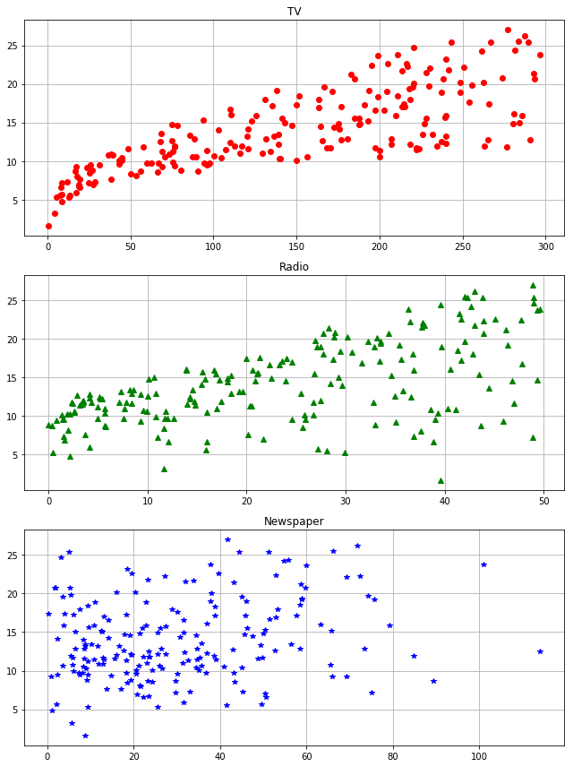
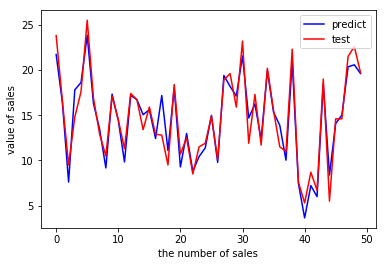
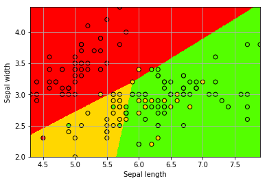
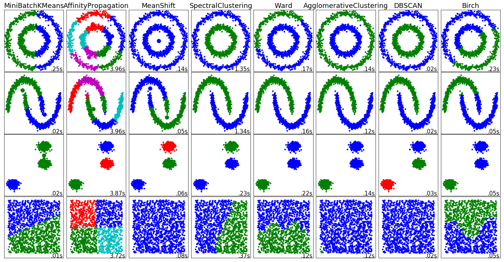

#  人工智障之傻瓜学习

[TOC]

## 1 线性回归

### 广告数据集

- 数据集名称：`Advertising.csv`

- 数据集内容：该数据集共4列200行，每一行表示一个特定的商品，前3列为输入特征，最后一列为输出特征。

  - 输入特征：	
    - TV：该商品用于电视上的广告费用 
    - Radio：在广播媒体上投资的广告费用
    - Newspaper：用于报纸媒体的广告费用 

  - 输出特征：
    - Sales：该商品的销量

### 初步分析

```python
import pandas as pd
import matplotlib.pyplot as plt

if __name__ == "__main__":
    # 导入数据
    path = 'Advertising.csv'
    data = pd.read_csv(path)
    x = data[['TV', 'Radio', 'Newspaper']]
    y = data['Sales']
    
    # 绘图
    plt.figure(figsize=(9,12))
    plt.subplot(311)
    plt.plot(data['TV'], y, 'ro')
    plt.title('TV')
    plt.grid()
    plt.subplot(312)
    plt.plot(data['Radio'], y, 'g^')
    plt.title('Radio')
    plt.grid()
    plt.subplot(313)
    plt.plot(data['Newspaper'], y, 'b*')
    plt.title('Newspaper')
    plt.grid()
    plt.tight_layout()
    plt.show()
```

### 绘图结果



> 观察发现Newspaper 散点图中Newspaper的线性关系并不明显。

### sklearn线性回归

```python
import pandas as pd
import numpy as np
import matplotlib.pyplot as plt

if __name__ == "__main__":
    # 导入数据data
    path = 'Advertising.csv'
    data = pd.read_csv(path)
    
    # 提取特征列x和标签y
    feature_cols = ['TV', 'Radio']
    x = data[feature_cols]
    y = data['Sales'] # 等价于 y = data.Sales
    
    # 划分训练集（x_train，y_train）和测试集（x_test，y_test）
    # 默认分割为75%的训练集，25%的测试集
    from sklearn.cross_validation import train_test_split
    x_train, x_test, y_train, y_test = train_test_split(x, y, random_state=1)
    
    # sklearn线性回归LinearRegression()
    from sklearn.linear_model import LinearRegression
    linreg = LinearRegression()
    
    # 训练模型
    model = linreg.fit(x_train, y_train)
	
    # 模型预测
    y_pred = linreg.predict(x_test)
    
    # 查看训练得到的相关系数
    coeffs = dict(zip(feature_cols, linreg.coef_))
    print(coeffs)
    
    # 使用RMSE评估预测结果
    sum_mean = 0
    for i in range(len(y_pred)):
        sum_mean += (y_pred[i] - y_test.values[i]) ** 2
    print("RMSE:", np.sqrt(sum_mean / len(y_pred)))
    
    # 绘图
    plt.figure()  
    plt.plot(range(len(y_pred)),y_pred,'b',label="predict")  
    plt.plot(range(len(y_test)),y_test,'r',label="test")  
    plt.legend(loc="upper right") 
    plt.xlabel("the number of sales")  
    plt.ylabel('value of sales')  
    plt.show() 
```

### 输出结果

- 3个输入特征的相关系数：

  `{'Radio': 0.17915812245088836, 'Newspaper': 0.0034504647111804065, 'TV': 0.046564567874150288}`

- 均方根误差(Root Mean Squared Error)：

  `RMSE: 1.40465142303`

- 绘图结果

  

  > - 根据3个输入特征的相关系数可以发现，Newspaper的系数很小 。
  > - 进一步观察，发现Newspaper 散点图中Newspaper的线性关系并不明显 。

**因此，尝试在训练模型的时候将输入特征Newspaper 移除，再看看线性回归预测结果的RMSE如何。**

```python
    # 修改提取的特征列x
    feature_cols = ['TV', 'Radio']
```

### 重新训练后的结果

- 3个输入特征的相关系数：

  `{'Radio': 0.18117959203112891, 'TV': 0.046602340710768547}`

- 均方根误差(Root Mean Squared Error)：

  `RMSE: 1.38790346994`

### 结论

在将Newspaper这个特征移除之后，得到RMSE变小了，说明Newspaper可能不适合作为预测销量的特征。

## 2 逻辑回归

### 鸢尾花数据集

- 数据集名称：`iris.data.txt`

- 数据集内容：该数据集包括3个鸢尾花类别，每个类别有50个样本。其中一个类别是与另外两类线性可分的，而另外两类不能线性可分。 每行代表一个鸢尾花样本，有4个输入特征和1个输出特征。

  - 输入特征：

    - sepal length
    - sepal width
    - petal length
    - petal width

  - 输出特征：

     - Iris Setosa

     - Iris Versicolour

     - Iris Virginica

### sklearn逻辑回归

​        

```python
import numpy as np
from sklearn.linear_model import LogisticRegression
import matplotlib.pyplot as plt

# 将3种鸢尾花类别映射为{0, 1, 2}
def iris_type(s):
    it = {b'Iris-setosa': 0,
          b'Iris-versicolor': 1,
          b'Iris-virginica': 2}
    return it[s]
     
if __name__ == "__main__":
    # 导入数据data
    path = 'iris.data.txt'
    data = np.loadtxt(path, dtype=float, delimiter=',', converters={4:iris_type})
    x, y = np.split(data, [4,], axis=1)
     
    # 为了可视化，仅使用前两列特征
    x= x[:, :2]
     
    # 训练模型
    logreg = LogisticRegression()
    logreg.fit(x, y.ravel())
    
    # 画图
    M, N = 500, 500
    x1_min, x1_max = x[:,0].min(), x[:,0].max()
    x2_min, x2_max = x[:,1].min(), x[:,1].max()
    t1 = np.linspace(x1_min, x1_max, M)
    t2 = np.linspace(x2_min, x2_max, N)
    x1, x2 = np.meshgrid(t1, t2)
    x_test = np.stack((x1.flat, x2.flat), axis=1)
    
    # 模型预测
    y_predict = logreg.predict(x_test)
    y_predict = y_predict.reshape(x1.shape)
    
    # 绘图
    plt.pcolormesh(x1,x2,y_predict,cmap=plt.cm.prism)
    plt.scatter(x[:, 0], x[:, 1], c=y, edgecolors='k', cmap=plt.cm.prism)
    
    # 显示样本
    plt.xlabel('Sepal length')
    plt.ylabel('Sepal width')
    plt.xlim(x1_min, x1_max)
    plt.ylim(x2_min, x2_max)
    plt.grid()
    plt.show()
    
    # 预测结果
    y_predict = logreg.predict(x)
    y = y.reshape(-1)
    result = y_predict == y
    c = np.count_nonzero(result)
    print('正确分类的样本数：', c)
    print('准确率： %.2f%%' % (100 * float(c) / float(len(result))))
```

### 输出结果

- 正确分类的样本数： `115`

- 准确率： `76.67%`

- 绘图结果

  

> 仅仅使用两个特征：花萼长度和宽度，在150个样本中，有115个分类正确，正确率为76.67% 。

**因此，尝试使用更多的特征（如4个全部使用） 来训练模型。**

```python
import numpy as np
from sklearn.linear_model import LogisticRegression
from sklearn.cross_validation import train_test_split

def iris_type(s):
    it = {b'Iris-setosa': 0,
          b'Iris-versicolor': 1,
          b'Iris-virginica': 2}
    return it[s]
    
if __name__ == "__main__":
    # 导入数据data
    path = 'iris.data.txt'
    data = np.loadtxt(path, dtype=float, delimiter=',', converters={4:iris_type})
    x, y = np.split(data, [4,], axis=1)
    
    # 使用逻辑回归训练模型
    logreg = LogisticRegression()
    logreg.fit(x, y.ravel())
    
    # 模型预测结果
    y_predict = logreg.predict(x)
    y = y.reshape(-1)
    result = y_predict == y
    c = np.count_nonzero(result)
    print('正确分类的样本数：', c)
    print('准确率： %.2f%%' % (100 * float(c) / float(len(result))))
```


### 重新训练后的结果

- 正确分类的样本数： `144`
- 准确率：` 96.00%`

### 结论

试验后会发现，当使用更多的特征进行训练后，模型在150个样本中，有144个分类正确，正确率为96%，分类效果提高明显。

## 3 决策树

决策树（Decision Tree）是一种简单但是广泛使用的分类器。通过训练数据构建决策树，可以高效地对未知的数据进行分类。

### 训练决策树

```python
import numpy as np
from sklearn import tree

def iris_type(s):
    it = {b'Iris-setosa': 0,
          b'Iris-versicolor': 1,
          b'Iris-virginica': 2}
    return it[s]
    
if __name__ == "__main__":
    # 导入数据data
    path = 'datasets\iris.data.txt'
    data = np.loadtxt(path, dtype=float, delimiter=',', converters={4:iris_type})
    x, y = np.split(data, [4,], axis=1)

    # 划分训练集（x_train，y_train）和测试集（x_test，y_test）
    # 默认分割为75%的训练集，25%的测试集
    from sklearn.cross_validation import train_test_split
    x_train, x_test, y_train, y_test = train_test_split(x, y, random_state=1)
    print('测试集样本数目：', len(x_test))
    
    # 初始化决策树
    clf = tree.DecisionTreeClassifier()
    
    # 训练决策树
    clf = clf.fit(x_train, y_train)
    
    # 预测样本
    y_predict = clf.predict(x_test)
    y_test = y_test.reshape(-1)
    result = y_predict == y_test
    c = np.count_nonzero(result)
    print('正确分类的样本数：', c)
    print('准确率： %.2f%%' % (100 * float(c) / float(len(result))))
```

### 输出结果

- 测试集样本数目： 38
- 正确分类的样本数： 37
- 准确率： 97.37%

> 由于训练测试样本太少，无法看出所训练模型的实际效果如何。

## 4 随机森林

随机森林`Random Forest`，指的是利用多棵树对样本进行训练并预测的一种分类器。它通过对数据集中的子样本进行训练，从而得到多棵决策树，以提高预测的准确性并控制在单棵决策树中极易出现的过拟合情况 。

## 5 支持向量机SVM

### 成人数据集

- 数据集名称：
  - 训练集：`adult.data.txt`
  - 测试集：`adult.test.txt`

- 数据集内容：该数据集记录的是一些成年人的基本信息，每条数据有`14`个输入特征和`1`个输出特征。该数据集的目的是：根据一个成人的`14`条基本信息，预测该人一年的薪资是否超过`50K`，`1`表示超过，`-1`表示不超过。

  - 输入特征：
    `age workclass fnlwgt(final weight) education education-num marital-status occupation relationship race sex captital-gain captital-loss hours-per-week native-country`

  - 输出特征：

    `>50K, <=50K`

**本数据集首先要做的处理是：将连续特征离散化，将有M个类别的离散特征转换为M个二进制特征。**

> 后面，我们使用[LIBSVM](https://www.csie.ntu.edu.tw/~cjlin/libsvm/)对`SVM`模型进行训练、预测。 因此，需要将数据处理成`LIBSVM `所需的数据格式。
>
> - `adult.data.txt` --> `a9a.txt`
> - `adult.test.txt` -->  `a9a.t`

### LIBSVM

- `LIBSVM`参数选项：

```shell
  -s svm_type : set type of SVM (default 0)
	0 -- C-SVC
	1 -- nu-SVC
	2 -- one-class SVM
	3 -- epsilon-SVR
	4 -- nu-SVR
-t kernel_type : set type of kernel function (default 2)
	0 -- linear: u'*v
	1 -- polynomial: (gamma*u'*v + coef0)^degree
	2 -- radial basis function: exp(-gamma*|u-v|^2)
	3 -- sigmoid: tanh(gamma*u'*v + coef0)
-d degree : set degree in kernel function (default 3)
-g gamma : set gamma in kernel function (default 1/num_features)
-r coef0 : set coef0 in kernel function (default 0)
-c cost : set the parameter C of C-SVC, epsilon-SVR, and nu-SVR (default 1)
-n nu : set the parameter nu of nu-SVC, one-class SVM, and nu-SVR (default 0.5)
-p epsilon : set the epsilon in loss function of epsilon-SVR (default 0.1)
-m cachesize : set cache memory size in MB (default 100)
-e epsilon : set tolerance of termination criterion (default 0.001)
-h shrinking: whether to use the shrinking heuristics, 0 or 1 (default 1)
-b probability_estimates: whether to train a SVC or SVR model for probability estimates, 0 or 1 (default 0)
-wi weight: set the parameter C of class i to weight*C, for C-SVC (default 1)
```

- 调用`LIBSVM`：

```python
import os
from svmutil import *

# 修改系统路径
os.chdir('tools\libsvm-3.23\python')

# 读取数据
train_y, train_x = svm_read_problem('../../../datasets/a9a.txt')
test_y, test_x = svm_read_problem('../../../datasets/a9a.t')

# 训练模型
m = svm_train(train_y, train_x, '-c 5')

# 测试模型
p_label, p_acc, p_val = svm_predict(test_y, test_x, m)
```

### 输出结果

- Accuracy = 84.9702% (13834/16281) (classification)

> 由结果可知，利用`LIBSVM`和`a9a`的训练集得到的`SVM`分类器模型在`a9a`测试集上的分类准确率约为84.97%。

## 6 聚类 

通过`MiniBatchKMeans`，`K-Means`，`SpectralClustering`，`DBSCAN`四种算法解决基本的聚类问题，使用`sklearn`提供的聚类模块和鸢尾花数据集，对聚类效果进行横向比较。

### 评价标准

- **Adjusted Rand Index（ARI）：**

用来计算两组标签之间的相似性，本实验中计算了算法聚类后得到的标签`algorithm.labels_`与数据集中真实类别标签`y`之间的相似性。取值范围：`-1~1`，值越大，相似性越高。

- **Homogeneity（同质性）：**

对于聚类结果中的每一个聚类，它只包含真实类别中的一个类的数据对象。取值范围：`0~1`，值越大，同质性越高。

- **Completeness（完整性）：**

对于真实类别中的一个类的全部数据对象，都被聚类到一个聚类中。取值范围：`0~1`，值越大，完整性越高。

### 比较不同算法性能1（iris数据集）

```python
from sklearn.cluster import MiniBatchKMeans, KMeans, SpectralClustering, DBSCAN
from sklearn.datasets import load_iris
from sklearn import metrics
import pandas as pd
import numpy as np
import time

# load dataset
iris = load_iris()
x = iris.data
y = iris.target

# create clustering estimators
three_means  = MiniBatchKMeans(n_clusters=3)
kmeans = KMeans(n_clusters=3)
spectral = SpectralClustering(n_clusters=3, eigen_solver='arpack')
dbscan = DBSCAN(eps=1.0)
cluster_algorithms = [three_means, kmeans, spectral, dbscan]

# evaluate the performances of 4 clustering algorithms
values = []
for algorithm in cluster_algorithms:
    t0 = time.time()
    # training
    algorithm.fit(x)
    t1 = time.time()
    delta_t = t1-t0
    # metrics
    ari = metrics.adjusted_rand_score(algorithm.labels_, y)
    homo = metrics.homogeneity_score(algorithm.labels_, y)
    compl = metrics.completeness_score(algorithm.labels_, y)
    scores = [ari, homo, compl, delta_t]
    values.append(scores)

# output measure values using DataFrame
cluster_names = ['MiniBatchKMeans', 'KMeans', 'SpectralClustering', 'DBSCAN']
metrics_names = ['ARI', 'Homo', 'Compl', 'Time']
df = pd.DataFrame(values, index=cluster_names, columns=metrics_names)
print(df)
```

### 输出结果1

|                    | ARI      | Homo     | Compl    | Time     |
| ------------------ | -------- | -------- | -------- | -------- |
| MiniBatchKMeans    | 0.730238 | 0.764986 | 0.751485 | 0.024001 |
| KMeans             | 0.730238 | 0.764986 | 0.751485 | 0.038002 |
| SpectralClustering | 0.743683 | 0.771792 | 0.760365 | 0.036002 |
| DBSCAN             | 0.568116 | 1.000000 | 0.579380 | 0.003000 |

> 分析可知，DBSCAN聚类速度最快，同质性指标值最高，达到了1.0，换言之，在DBSCAN算法中，聚类出来的每一个聚类都只包含真实类别中的一个类的数据对象，而完整性指标值最低，这是因为DBSCAN算法将低密度区域中的边缘数据对象当作噪声点抛弃，导致完整性不高。KMeans算法和SpectralClustering算法，聚类速度大致相同，SpectralClustering算法的评价指标略优于KMeans算法。MiniBatchKMeans与 KMeans聚类效果相同，但用时更短。

### 比较不同算法性能2（toy数据集）

```pythona
import time
import numpy as np
import matplotlib.pyplot as plt
from sklearn import cluster, datasets
from sklearn.neighbors import kneighbors_graph
from sklearn.preprocessing import StandardScaler

np.random.seed(0)

# Generate datasets. We choose the size big enough to see the scalability
# of the algorithms, but not too big to avoid too long running times
n_samples = 1500
noisy_circles = datasets.make_circles(n_samples=n_samples, factor=.5,
                                      noise=.05)
noisy_moons = datasets.make_moons(n_samples=n_samples, noise=.05)
blobs = datasets.make_blobs(n_samples=n_samples, random_state=8)
no_structure = np.random.rand(n_samples, 2), None

colors = np.array([x for x in 'bgrcmykbgrcmykbgrcmykbgrcmyk'])
colors = np.hstack([colors] * 20)

clustering_names = [
    'MiniBatchKMeans', 'AffinityPropagation', 'MeanShift',
    'SpectralClustering', 'Ward', 'AgglomerativeClustering',
    'DBSCAN', 'Birch']

plt.figure(figsize=(len(clustering_names) * 2 + 3, 9.5))
plt.subplots_adjust(left=.02, right=.98, bottom=.001, top=.96, wspace=.05,
                    hspace=.01)

plot_num = 1

datasets = [noisy_circles, noisy_moons, blobs, no_structure]
for i_dataset, dataset in enumerate(datasets):
    X, y = dataset
    # normalize dataset for easier parameter selection
    X = StandardScaler().fit_transform(X)

    # estimate bandwidth for mean shift
    bandwidth = cluster.estimate_bandwidth(X, quantile=0.3)

    # connectivity matrix for structured Ward
    connectivity = kneighbors_graph(X, n_neighbors=10, include_self=False)
    # make connectivity symmetric
    connectivity = 0.5 * (connectivity + connectivity.T)

    # create clustering estimators
    ms = cluster.MeanShift(bandwidth=bandwidth, bin_seeding=True)
    two_means = cluster.MiniBatchKMeans(n_clusters=2)
    ward = cluster.AgglomerativeClustering(n_clusters=2, linkage='ward',
                                           connectivity=connectivity)
    spectral = cluster.SpectralClustering(n_clusters=2,
                                          eigen_solver='arpack',
                                          affinity="nearest_neighbors")
    dbscan = cluster.DBSCAN(eps=.2)
    affinity_propagation = cluster.AffinityPropagation(damping=.9,
                                                       preference=-200)

    average_linkage = cluster.AgglomerativeClustering(
        linkage="average", affinity="cityblock", n_clusters=2,
        connectivity=connectivity)

    birch = cluster.Birch(n_clusters=2)
    clustering_algorithms = [
        two_means, affinity_propagation, ms, spectral, ward, average_linkage,
        dbscan, birch]

    for name, algorithm in zip(clustering_names, clustering_algorithms):
        # predict cluster memberships
        t0 = time.time()
        algorithm.fit(X)
        t1 = time.time()
        if hasattr(algorithm, 'labels_'):
            y_pred = algorithm.labels_.astype(np.int)
        else:
            y_pred = algorithm.predict(X)

        # plot
        plt.subplot(4, len(clustering_algorithms), plot_num)
        if i_dataset == 0:
            plt.title(name, size=18)
        plt.scatter(X[:, 0], X[:, 1], color=colors[y_pred].tolist(), s=10)

        if hasattr(algorithm, 'cluster_centers_'):
            centers = algorithm.cluster_centers_
            center_colors = colors[:len(centers)]
            plt.scatter(centers[:, 0], centers[:, 1], s=100, c=center_colors)
        plt.xlim(-2, 2)
        plt.ylim(-2, 2)
        plt.xticks(())
        plt.yticks(())
        plt.text(.99, .01, ('%.2fs' % (t1 - t0)).lstrip('0'),
                 transform=plt.gca().transAxes, size=15,
                 horizontalalignment='right')
        plot_num += 1

plt.show()
```

### 输出结果2




##7 EM算法

> 概率模型有时既含有观测变量，又含有隐变量或者潜在变量。如果概率模型的变量都是观测变量，可以直接使用极大似然估计法或者贝叶斯的方法进行估计模型参数，但是当模型含有隐藏变量时，就不能简单使用这些方法了。EM算法就是含有隐变量的概率模型参数的极大似然估计法，或者极大似然后验概率估计法。

### EM 算法步骤

- 输入：观测变量数据`Y`，隐变量数据`Z`，联合分布`P(Y,Z|θ)`，条件分布`P(Z|Y,θ)`.
- 输出：模型参数`θ`.

###EM算法求解高斯混合模型

```python
from __future__ import print_function
import numpy as np

def generateData(k,mu,sigma,dataNum):
    '''
    产生混合高斯模型的数据
    :param k: 比例系数
    :param mu: 均值
    :param sigma: 标准差
    :param dataNum:数据个数
    :return: 生成的数据
    '''
    # 初始化数据
    dataArray = np.zeros(dataNum,dtype=np.float32)
    # 逐个依据概率产生数据
    # 高斯分布个数
    n = len(k)
    for i in range(dataNum):
        # 产生[0,1]之间的随机数
        rand = np.random.random()
        Sum = 0
        index = 0
        while(index < n):
            Sum += k[index]
            if(rand < Sum):
                dataArray[i] = np.random.normal(mu[index],sigma[index])
                break
            else:
                index += 1
    return dataArray

def normPdf(x,mu,sigma):
    '''
    计算均值为mu，标准差为sigma的正态分布函数的密度函数值
    :param x: x值
    :param mu: 均值
    :param sigma: 标准差
    :return: x处的密度函数值
    '''
    return (1./np.sqrt(2*np.pi))*(np.exp(-(x-mu)**2/(2*sigma**2)))

def em(dataArray,k,mu,sigma,step = 10):
    '''
    em算法估计高斯混合模型
    :param dataNum: 已知数据个数
    :param k: 每个高斯分布的估计系数
    :param mu: 每个高斯分布的估计均值
    :param sigma: 每个高斯分布的估计标准差
    :param step:迭代次数
    :return: em 估计迭代结束估计的参数值[k,mu,sigma]
    '''
    # 高斯分布个数
    n = len(k)
    # 数据个数
    dataNum = dataArray.size
    # 初始化gama数组
    gamaArray = np.zeros((n,dataNum))
    for s in range(step):
        for i in range(n):
            for j in range(dataNum):
                Sum = sum([k[t]*normPdf(dataArray[j],mu[t],sigma[t]) for t in range(n)])
                gamaArray[i][j] = k[i]*normPdf(dataArray[j],mu[i],sigma[i])/float(Sum)
        # 更新 mu
        for i in range(n):
            mu[i] = np.sum(gamaArray[i]*dataArray)/np.sum(gamaArray[i])
        # 更新 sigma
        for i in range(n):
            sigma[i] = np.sqrt(np.sum(gamaArray[i]*(dataArray - mu[i])**2)/np.sum(gamaArray[i]))
        # 更新系数k
        for i in range(n):
            k[i] = np.sum(gamaArray[i])/dataNum

    return [k,mu,sigma]

if __name__ == '__main__':
    # 参数的准确值
    k = [0.3,0.4,0.3]
    mu = [2,4,3]
    sigma = [1,1,4]
    # 样本数
    dataNum = 5000
    # 产生数据
    dataArray = generateData(k,mu,sigma,dataNum)
    # 参数的初始值
    # 注意em算法对于参数的初始值是十分敏感的
    k0 = [0.3,0.3,0.4]
    mu0 = [1,2,2]
    sigma0 = [1,1,1]
    step = 6
    # 使用em算法估计参数
    k1,mu1,sigma1 = em(dataArray,k0,mu0,sigma0,step)
    # 输出参数的值
    print("参数实际值:")
    print("k:",k)
    print("mu:",mu)
    print("sigma:",sigma)
    print("参数估计值:")
    print("k1:",k1)
    print("mu1:",mu1)
    print("sigma1:",sigma1)
```

### 输出结果

```python
参数实际值:
k: [0.3, 0.4, 0.3]
mu: [2, 4, 3]
sigma: [1, 1, 4]
参数估计值:
k1: [0.54300716659941051, 0.19585407145739436, 0.26113876194319507]
mu1: [2.8156569715274342, 3.2809062129971607, 3.2809062129971629]
sigma1: [3.1837915155454017, 1.3907640263285175, 1.3907640263285221]
```
## 8 LDA自然语言处理

LDA（Latent Dirichlet Allocation）是一种文档主题生成模型，也称为一个三层贝叶斯概率模型，包含词、主题和文档三层结构。所谓生成模型，就是说，我们认为一篇文章的每个词都是通过“以一定概率选择了某个主题，并从这个主题中以一定概率选择某个词语”这样一个过程得到。文档到主题服从多项式分布，主题到词服从多项式分布。 

LDA是一种非监督机器学习技术，可以用来识别大规模文档集（document collection）或语料库（corpus）中潜藏的主题信息。它采用了词袋（bag of words）的方法，这种方法将每一篇文档视为一个词频向量，从而将文本信息转化为了易于建模的数字信息。但是词袋方法没有考虑词与词之间的顺序，这简化了问题的复杂性，同时也为模型的改进提供了契机。每一篇文档代表了一些主题所构成的一个概率分布，而每一个主题又代表了很多单词所构成的一个概率分布。 

LDA模型的推导过程包括多项式分布、Dirichlet分布和Gibbs抽样等。具体来说，主要在以下几个方面有广泛的应用： 
（1）通过Dirichlet分布取样获得生成文档的主题分布和生成主题的词语分布。 
（2）通过主题的多项式分布取样，得到当前文档的对应词语的主题。 
（3）通过词语的多项式分布采样，得到生成的词语。

### 基于LDA的文章主题生成

```python
import numpy as np
import lda
import lda.datasets

'''
1.导入数据源
'''
#通过LDA库自带的API接口调用路透社的数据
titles = lda.datasets.load_reuters_titles()

for i in range(395):
    print(titles[i])

'''
2.求解P(词语|主题),得到每个主题所包含的单词的分布
'''
X = lda.datasets.load_reuters()
vocab = lda.datasets.load_reuters_vocab()
titles = lda.datasets.load_reuters_titles()
#设置主题数目为20个，每个主题包含8个词语，模型迭代次数为1500次
model = lda.LDA(n_topics=20,n_iter=1500,random_state=1)
model.fit(X)
topic_word = model.topic_word_
n_top_words = 8

for i,topic_dist in enumerate(topic_word):
    topic_words = np.array(vocab)[np.argsort(topic_dist)][:-(n_top_words+1):-1]
    #输出每个主题所包含的单词的分布
    print('Topic{}:{}'.format(i,''.join(topic_words)))

'''
3.求解P(主题|文档),得到文章所对应的主题
'''
doc_topic = model.doc_topic_
for i in range(20):
    #输出文章所对应的主题
    print("{} (top topic:{})".format(titles[i],doc_topic[i].argmax()))
```

### 输出结果

```python
INFO:lda:n_documents: 395
INFO:lda:vocab_size: 4258
INFO:lda:n_words: 84010
INFO:lda:n_topics: 20
INFO:lda:n_iter: 1500
```

> 由上图可知，调用的**数据集文章数为395**，**文章单词个数为84010**，**文章主题数为20个**。 

## 9 MNIST手写数字识别

### 下载MNIST数据集

```python
# 从tensorflow.examples.tutorials.mnist引入模块。这是TensorFlow为了教学MNIST而提前编制的程序
from tensorflow.examples.tutorials.mnist import input_data
# 从MNIST_data/中读取MNIST数据。这条语句在数据不存在时，会自动执行下载
mnist = input_data.read_data_sets("MNIST_data/", one_hot=True)

# 查看训练数据的大小
print(mnist.train.images.shape)  # (55000, 784)
print(mnist.train.labels.shape)  # (55000, 10)

# 查看验证数据的大小
print(mnist.validation.images.shape)  # (5000, 784)
print(mnist.validation.labels.shape)  # (5000, 10)

# 查看测试数据的大小
print(mnist.test.images.shape)  # (10000, 784)
print(mnist.test.labels.shape)  # (10000, 10)

# 打印出第0幅图片的向量表示
print(mnist.train.images[0, :])

# 打印出第0幅图片的标签
print(mnist.train.labels[0, :])
```

### 将MNIST数据集保存为图片

```python
from tensorflow.examples.tutorials.mnist import input_data
import scipy.misc
import os

# 读取MNIST数据集。如果不存在会事先下载。
mnist = input_data.read_data_sets("MNIST_data/", one_hot=True)

# 我们把原始图片保存在MNIST_data/raw/文件夹下
# 如果没有这个文件夹会自动创建
save_dir = 'MNIST_data/raw/'
if os.path.exists(save_dir) is False:
    os.makedirs(save_dir)

# 保存前20张图片
for i in range(20):
    # 请注意，mnist.train.images[i, :]就表示第i张图片（序号从0开始）
    image_array = mnist.train.images[i, :]
    # TensorFlow中的MNIST图片是一个784维的向量，我们重新把它还原为28x28维的图像。
    image_array = image_array.reshape(28, 28)
    # 保存文件的格式为 mnist_train_0.jpg, mnist_train_1.jpg, ... ,mnist_train_19.jpg
    filename = save_dir + 'mnist_train_%d.jpg' % i
    # 将image_array保存为图片
    # 先用scipy.misc.toimage转换为图像，再调用save直接保存。
    scipy.misc.toimage(image_array, cmin=0.0, cmax=1.0).save(filename)

print('Please check: %s ' % save_dir)
```

### 打印图片的标签

```python
from tensorflow.examples.tutorials.mnist import input_data
import numpy as np
# 读取mnist数据集。如果不存在会事先下载。
mnist = input_data.read_data_sets("MNIST_data/", one_hot=True)

# 看前20张训练图片的label
for i in range(20):
    # 得到one-hot表示，形如(0, 1, 0, 0, 0, 0, 0, 0, 0, 0)
    one_hot_label = mnist.train.labels[i, :]
    # 通过np.argmax我们可以直接获得原始的label
    # 因为只有1位为1，其他都是0
    label = np.argmax(one_hot_label)
    print('mnist_train_%d.jpg label: %d' % (i, label))
```

### Softmax 回归

```python
# 导入tensorflow。
# 这句import tensorflow as tf是导入TensorFlow约定俗成的做法，请大家记住。
import tensorflow as tf
# 导入MNIST教学的模块
from tensorflow.examples.tutorials.mnist import input_data
# 与之前一样，读入MNIST数据
mnist = input_data.read_data_sets("MNIST_data/", one_hot=True)

# 创建x，x是一个占位符（placeholder），代表待识别的图片
x = tf.placeholder(tf.float32, [None, 784])

# W是Softmax模型的参数，将一个784维的输入转换为一个10维的输出
# 在TensorFlow中，变量的参数用tf.Variable表示
W = tf.Variable(tf.zeros([784, 10]))
# b是又一个Softmax模型的参数，我们一般叫做“偏置项”（bias）。
b = tf.Variable(tf.zeros([10]))

# y=softmax(Wx + b)，y表示模型的输出
y = tf.nn.softmax(tf.matmul(x, W) + b)

# y_是实际的图像标签，同样以占位符表示。
y_ = tf.placeholder(tf.float32, [None, 10])

# 至此，我们得到了两个重要的Tensor：y和y_。
# y是模型的输出，y_是实际的图像标签，不要忘了y_是独热表示的
# 下面我们就会根据y和y_构造损失

# 根据y, y_构造交叉熵损失
cross_entropy = tf.reduce_mean(-tf.reduce_sum(y_ * tf.log(y)))

# 有了损失，我们就可以用随机梯度下降针对模型的参数（W和b）进行优化
train_step = tf.train.GradientDescentOptimizer(0.01).minimize(cross_entropy)

# 创建一个Session。只有在Session中才能运行优化步骤train_step。
sess = tf.InteractiveSession()
# 运行之前必须要初始化所有变量，分配内存。
tf.global_variables_initializer().run()
print('start training...')

# 正确的预测结果
correct_prediction = tf.equal(tf.argmax(y, 1), tf.argmax(y_, 1))
# 计算预测准确率，它们都是Tensor
accuracy = tf.reduce_mean(tf.cast(correct_prediction, tf.float32))

# 进行1000步梯度下降
for i in range(1000):
    # 在mnist.train中取100个训练数据
    # batch_xs是形状为(100, 784)的图像数据，batch_ys是形如(100, 10)的实际标签
    # batch_xs, batch_ys对应着两个占位符x和y_
    batch_xs, batch_ys = mnist.train.next_batch(100)
    # 在Session中运行train_step，运行时要传入占位符的值
    sess.run(train_step, feed_dict={x: batch_xs, y_: batch_ys})
    if i % 100 == 0:
        print('\t', i, sess.run(accuracy, feed_dict={x: batch_xs, y_: batch_ys}))


# 在Session中运行Tensor可以得到Tensor的值
# 这里是获取最终模型的正确率
print(sess.run(accuracy, feed_dict={x: mnist.test.images, y_: mnist.test.labels}))  # 0.9185
```

### 两层卷积网络分类

```python
import tensorflow as tf
from tensorflow.examples.tutorials.mnist import input_data


# shape = (64,3,3,3)
def weight_variable(shape):
    initial = tf.truncated_normal(shape, stddev=0.1)    # [-2*sigma, 2*sigma]
    return tf.Variable(initial)


def bias_variable(shape):
    initial = tf.constant(0.1, shape=shape)
    return tf.Variable(initial)


def conv2d(x, W):
    return tf.nn.conv2d(x, W, strides=[1, 1, 1, 1], padding='SAME')


def max_pool_2x2(x):
    return tf.nn.max_pool(x, ksize=[1, 2, 2, 1],
                          strides=[1, 2, 2, 1], padding='SAME')


if __name__ == '__main__':
    # 读入数据
    mnist = input_data.read_data_sets("MNIST_data/", one_hot=True)
    # x为训练图像的占位符、y_为训练图像标签的占位符
    x = tf.placeholder(tf.float32, [None, 784])
    y_ = tf.placeholder(tf.float32, [None, 10])

    # 将单张图片从784维向量重新还原为28x28的矩阵图片
    x_image = tf.reshape(x, [-1, 28, 28, 1])

    # 第一层卷积层
    W_conv1 = weight_variable([5, 5, 1, 32])
    b_conv1 = bias_variable([32])
    h_conv1 = tf.nn.relu(conv2d(x_image, W_conv1) + b_conv1)
    h_pool1 = max_pool_2x2(h_conv1)

    # 第二层卷积层
    W_conv2 = weight_variable([5, 5, 32, 64])
    b_conv2 = bias_variable([64])
    h_conv2 = tf.nn.relu(conv2d(h_pool1, W_conv2) + b_conv2)
    h_pool2 = max_pool_2x2(h_conv2)

    # 全连接层，输出为1024维的向量
    W_fc1 = weight_variable([7 * 7 * 64, 1024])
    b_fc1 = bias_variable([1024])
    h_pool2_flat = tf.reshape(h_pool2, [-1, 7 * 7 * 64])
    h_fc1 = tf.nn.relu(tf.matmul(h_pool2_flat, W_fc1) + b_fc1)
    # 使用Dropout，keep_prob是一个占位符，训练时为0.5，测试时为1
    keep_prob = tf.placeholder(tf.float32)
    h_fc1_drop = tf.nn.dropout(h_fc1, keep_prob)

    # 把1024维的向量转换成10维，对应10个类别
    W_fc2 = weight_variable([1024, 10])
    b_fc2 = bias_variable([10])
    y_conv = tf.matmul(h_fc1_drop, W_fc2) + b_fc2

    # 我们不采用先Softmax再计算交叉熵的方法，而是直接用tf.nn.softmax_cross_entropy_with_logits直接计算
    cross_entropy = tf.reduce_mean(
        tf.nn.softmax_cross_entropy_with_logits(labels=y_, logits=y_conv))
    # 同样定义train_step
    train_step = tf.train.AdamOptimizer(1e-4).minimize(cross_entropy)

    # 定义测试的准确率
    correct_prediction = tf.equal(tf.argmax(y_conv, 1), tf.argmax(y_, 1))
    accuracy = tf.reduce_mean(tf.cast(correct_prediction, tf.float32))

    # 创建Session和变量初始化
    sess = tf.InteractiveSession()
    sess.run(tf.global_variables_initializer())

    # 训练20000步
    for i in range(20000):
        batch = mnist.train.next_batch(50)
        # 每100步报告一次在验证集上的准确度
        if i % 100 == 0:
            train_accuracy = accuracy.eval(feed_dict={
                x: batch[0], y_: batch[1], keep_prob: 1.0})
            print("step %d, training accuracy %g" % (i, train_accuracy))
        train_step.run(feed_dict={x: batch[0], y_: batch[1], keep_prob: 0.5})

    # 训练结束后报告在测试集上的准确度
    print("test accuracy %g" % accuracy.eval(feed_dict={
        x: mnist.test.images, y_: mnist.test.labels, keep_prob: 1.0}))
```

